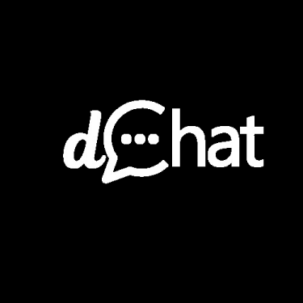

# dChat



[**Live Demo**](https://your-dchat-deployment.vercel.app) | [**Report Bug**](https://github.com/your-username/dChat/issues) | [**Request Feature**](https://github.com/your-username/dChat/issues)

**dChat** is a decentralized, secure messaging application built on the **XMTP (Extensible Message Transport Protocol)** network. It enables wallet-to-wallet communication with end-to-end encryption, ensuring privacy and ownership of your data.


## Key Features

- **Wallet-to-Wallet Messaging**: Log in securely with your Ethereum wallet (MetaMask, Rainbow, etc.).
- **End-to-End Encryption**: Messages are encrypted and can only be decrypted by the intended recipient.
- **XMTP V3 Integration**: Utilizes the latest XMTP browser SDK for enhanced performance and group chat capabilities.
- **Session Management**: Manages device limits (10/10 installations) with an integrated revocation feature.
- **Dark Mode UI**: A premium, monochromatic dark aesthetic designed with Tailwind CSS.
- **Auto-Scroll**: Smart scrolling behavior that keeps you at the latest message.
- **IPFS File Sharing**: Securely share images and files using Pinata IPFS and XMTP Remote Attachments.
- **Smart Date Headers**: Messages are intuitively grouped by date (Today, Yesterday, etc.).
- **Delete for Everyone**: Withdraw messages for all participants using custom XMTP content types.
- **Responsive Design**: Optimized for a seamless experience on both mobile and desktop devices.

## Tech Stack

### Core Frameworks
- **[Next.js 16 (App Router)](https://nextjs.org/)**: The React framework for production, handling routing and server-side rendering.
- **[TypeScript](https://www.typescriptlang.org/)**: Ensures type safety and developer productivity.
- **[Tailwind CSS 4](https://tailwindcss.com/)**: A utility-first CSS framework for rapid UI development.
- **[shadcn/ui](https://ui.shadcn.com/)**: Reusable components built with Radix UI and Tailwind CSS.

### Web3 & Messaging
- **[@xmtp/browser-sdk (V3)](https://xmtp.org/)**: The core library for interacting with the XMTP network.
- **[Wagmi](https://wagmi.sh/) & [Viem](https://viem.sh/)**: Essential hooks and utilities for Ethereum wallet interaction.
- **[RainbowKit](https://www.rainbowkit.com/)**: A polished, customizable wallet connection UI.
- **[Pinata SDK (pinata-web3)](https://www.pinata.cloud/)**: Decentralized file storage for secure attachment handling.
- **@xmtp/content-type-remote-attachment**: Standard codec for handling large file attachments.

## Project Structure

The project follows a standard Next.js App Router structure, with logic separated into `components`, `lib`, and `hooks`.

```
src/
├── app/                    # Next.js App Router pages
│   ├── chat/               # Main chat interface route (Protected)
│   │   └── page.tsx        # Chat page entry point
│   ├── layout.tsx          # Global layout (Providers, Fonts)
│   └── page.tsx            # Landing page (redirects to /chat)
│
├── components/
│   ├── auth/               # Authentication components
│   │   └── login-button.tsx
│   ├── chat/               # Chat-specific UI components
│   │   ├── ChatLayout.tsx          # Main grid layout
│   │   ├── ChatSidebar.tsx         # List of active conversations
│   │   ├── ChatWindow.tsx          # Message view for a specific chat
│   │   ├── MessageBubble.tsx       # Styled message row
│   │   ├── NewChatModal.tsx        # Start new conversation
│   ├── layout/             # Shared layout components
│   │   └── navbar.tsx
│   ├── ui/                 # Reusable UI components (shadcn/ui)
│   └── providers.tsx       # Global providers wrapper
│
├── hooks/
│   ├── use-toast.tsx       # Toast notifications
│   └── useConversationDisplay.ts
│
├── lib/
│   ├── ipfs.ts             # IPFS Upload Service
│   ├── logger.ts           # Logging utility
│   ├── utils.ts            # Class merging utility (cn)
│   └── xmtp/               # XMTP Logic Isolation
│       ├── client.ts       # Client creation & config
│       ├── conversations.ts
│       ├── messages.ts     # Message handling
│       └── codecs/         # Custom Content Types
│
└── types/
    └── chat.ts             # TypeScript definitions
```

## Live Application

The application is deployed and accessible at the following URL:
**[https://your-dchat-deployment.vercel.app](https://your-dchat-deployment.vercel.app)**

## License

This project is licensed under the [MIT License](LICENSE).